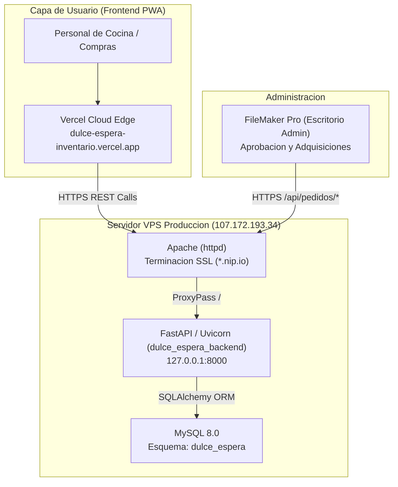

# Manual Tecnico y Arquitectura del Sistema - Dulce Espera Inventario

Fecha de actualizacion: Septiembre 2026  
Autor: Rene Velasquez  
Proyectos:
- Frontend PWA: `velasquezren/dulce-espera-inventario` (Next.js 16 + React 19 + TailwindCSS 4 en Vercel)
- Backend API: `velasquezren/dulce-espera-inventario-backend` (FastAPI + SQLAlchemy + MySQL 8.0 en VPS)

---

## 1. REGLAS CRITICAS: Convivencia y Seguridad en el Servidor VPS (107.172.193.34)

> [!CAUTION]
> **OBLIGATORIO PARA CUALQUIER DESARROLLADOR O AGENTE IA:**  
> Este servidor ejecuta multiples servicios de produccion criticos para la Clinica Montalvo.  
> Romper o reiniciar servicios ajenos interrumpira la operacion medica del CRM hospitalario.

### 1.1 Mapa de Servicios en el Host

| Servicio | Propietario / Funcion | Puerto | Politica Operativa |
|---|---|---|---|
| `crm_backend.service` | Backend NestJS - CRM Hospitalario | 3000 | **PROHIBIDO TOCAR, MODIFICAR O REINICIAR** |
| `postgresql.service` | Base de datos relacional del CRM | 5432 | **PROHIBIDO DETENER O MODIFICAR** |
| `httpd.service` | Apache Web Server / Reverse Proxy SSL | 80, 443 | **NO REINICIAR SIN TEST PREVIO (`httpd -t`)** |
| `mysqld.service` | MySQL 8.0 Multi-Esquema | 3306 | **NO REINICIAR GLOBALMENTE** |
| `dulce_espera_backend.service` | Backend FastAPI - Dulce Espera | 8000 | **UNICO SERVICIO AUTORIZADO PARA ESTE PROYECTO** |

### 1.2 Fronteras Operativas (Blast Radius)

Toda intervencion para este proyecto debe realizarse **EXCLUSIVAMENTE** dentro de los siguientes limites:
- **Directorio de aplicacion:** `/opt/dulce_espera_backend`
- **Entorno virtual Python:** `/opt/dulce_espera_backend/venv`
- **Servicio Systemd:** `dulce_espera_backend.service`
- **Esquema MySQL:** Unicamente `dulce_espera`
- **Usuario MySQL:** `app_dulce_espera`

### 1.3 Mandamientos Inviolables de Operacion
1. **NUNCA ejecutar `reboot`:** Apagara el CRM, PostgreSQL y servicios hospitalarios.
2. **NUNCA ejecutar `killall python`:** El servidor corre scripts de mantenimiento en Python.
3. **NUNCA ejecutar `systemctl restart mysqld`:** Se interrumpen las transacciones del CRM.
4. **Comando oficial de reinicio del proyecto:**
   ```bash
   sudo systemctl restart dulce_espera_backend
   ```
5. **Comando de diagnostico de salud:**
   ```bash
   sudo systemctl status dulce_espera_backend --no-pager
   curl -s http://127.0.0.1:8000/health
   ```

---

## 2. Arquitectura Global del Sistema



---

## 3. Catalogo de Insumos 2026 y Modelo Relacional

### 3.1 Catalogo 2026 (`Insumos2026.xlsx`)
- **800 registros cargados en total.**
- **771 insumos activos:** Disponibles en la PWA para creacion de pedidos de cocina.
- **29 insumos historicos (`activo = 0`):** Preservados para mantener integridad referencial de llaves foraneas con pedidos pasados en `detalle_pedido`.

### 3.2 Canales de Compra (`canal_compra`)
1. **Super Mercado (324 insumos):** Abarrotes empacados, pastas, harinas, aceites, enlatados, condimentos y suministros de limpieza.
2. **Mercado (323 insumos):** Perecederos frescos: verduras, hortalizas, frutas, tuberculos, carnes y pollo.
3. **Proveedor (119 insumos):** Proveedores mayoristas institucionales, formulas nutricionales y suministros especializados.
4. **Otros (34 insumos):** Panaderia diaria, bolsas y descartables.

### 3.3 Tablas Principales de Base de Datos
- `insumos`: `id_publico` (PK), `nombre`, `categoria`, `presentacion`, `canal_compra`, `activo`, `fecha_actualizacion`.
- `pedidos`: `id_publico` (PK UUID), `solicitante`, `fecha_solicitud`, `estado`, `fecha_estado`, `motivo`.
- `detalle_pedido`: `id_publico` (PK UUID), `pedido_id_publico` (FK), `insumo_id_publico` (FK), `cantidad`.
- `coordinadores`: `id` (PK INT), `nombre`, `telefono`, `activo`.
- `usuarios`: `id` (PK INT), `username`, `password`, `nombre_display`, `rol`, `activo`.

---

## 4. Motor de Reportes y Despacho

### 4.1 Excel Profesional con OpenPyXL
- **Reporte por Pedido:** `GET /pedidos/{id_publico}/reporte/excel`
  - Encabezados en verde clinico institucional `#006156`.
  - Agrupacion por canal con subtotales automaticos mediante formulas `=SUM(D{inicio}:D{fin})`.
  - Columnas de recepcion: `[  ] Recibido`, `Cant. Fisica`, `Observaciones`.
  - Bloques de firmas para Solicitante, Compras y Recepcion.
- **Reporte Maestro de Compras:** `GET /api/pedidos/pendientes/excel`
  - Consolida todas las solicitudes en estado `pendiente` agrupadas por canal para la gobernanta.

### 4.2 PDF con xhtml2pdf
- Endpoint: `GET /pedidos/{id_publico}/reporte/pdf`
- Documento formal en escala tipografica estricta, libre de emojis, optimizado para impresion fisica.

### 4.3 Imagen WhatsApp en Alta Densidad (Canvas 4x)
- Componente `WhatsAppDispatch.tsx` con soporte de vista segmentada por canal o secuencial plana, exportacion Blob y Web Share API.

---

## 5. Estructura y Rendimiento del Frontend (Next.js 16)

### 5.1 Jerarquia de Componentes
```
app/
├── layout.tsx                  # Root layout, fuentes Geist, viewport y Service Worker
├── page.tsx                    # Enrutador cliente tipo SPA por modulo activo
├── globals.css                 # Estilos y variables de TailwindCSS 4
├── context/
│   └── AppContext.tsx          # Store global reactivo, offline localStorage y cache
└── components/
    ├── Header.tsx              # Encabezado institucional
    ├── Sidebar.tsx             # Barra lateral colapsable
    ├── BottomNav.tsx           # Navegacion movil
    ├── ResumenDiaCard.tsx      # Tarjeta de metricas de cocina
    ├── SemaforoButtons.tsx     # Selector de criticidad (Rojo, Amarillo, Verde)
    ├── AudioRecorder.tsx       # Grabadora de notas de voz
    ├── AudioPlayer.tsx         # Reproductor de audio adjunto
    └── Modules/
        ├── Login.tsx           # Formulario de acceso
        ├── Dashboard.tsx       # Acciones rapidas
        ├── Inventory.tsx       # Catalogo, busqueda y filtros por canal
        ├── RequestForm.tsx     # Solicitudes y cuaderno borrador
        ├── MyRequests.tsx      # Seguimiento de pedidos
        ├── Reception.tsx       # Verificacion y recepcion de mercancia
        ├── History.tsx         # Registro historico
        ├── WhatsAppDispatch.tsx# Despacho de Excel, PDF e imagen
        ├── ComprasView.tsx     # Vista especializada para rol compras
        └── ManageProducts.tsx  # Administracion de catalogo
```

### 5.2 Estandares de Calidad
- **Politica Cero Emojis:** Prohibido el uso de caracteres emoji. Solo iconos vectoriales `lucide-react`.
- **Rendimiento React 19:** Memorizacion de calculos pesados con `useMemo` y paginacion/filtrado virtual en catalogo de 800 insumos.
- **PWA Offline Resilience:** La aplicacion funciona con microcortes de red gracias a `localStorage` y cache del Service Worker.

---

## 6. Runbook de Despliegue y Mantenimiento

### 6.1 Despliegue de Frontend (Vercel)
```bash
cd "/Users/macmini2024/Documents/CARPETA RENE/dulce-espera-inventario"
npm run build
git add .
git commit -m "feat: actualizacion frontend"
git push origin main
```

### 6.2 Despliegue de Backend (VPS)
```bash
# 1. Commit y push local en repo de backend
cd "/Users/macmini2024/Documents/CARPETA RENE/inventario-dulce-espera/dulce-espera-inventario-backend"
git add .
git commit -m "feat: actualizacion backend"
git push origin main

# 2. Despliegue en VPS
ssh root@107.172.193.34
cd /opt/dulce_espera_backend
git pull origin main
/opt/dulce_espera_backend/venv/bin/pip install -r requirements.txt
sudo systemctl restart dulce_espera_backend
sudo systemctl status dulce_espera_backend --no-pager
```

### 6.3 Diagnostico y Resolucion de Errores

```bash
# Ver ultimos logs del backend en tiempo real
journalctl -u dulce_espera_backend -n 100 -f

# Verificar salud general de la API
curl -s https://107.172.193.34.nip.io/health

# Comprobar puerto 8000
ss -tlpn | grep 8000

# Rollback de emergencia en backend
cd /opt/dulce_espera_backend
git reset --hard HEAD~1
sudo systemctl restart dulce_espera_backend
```
