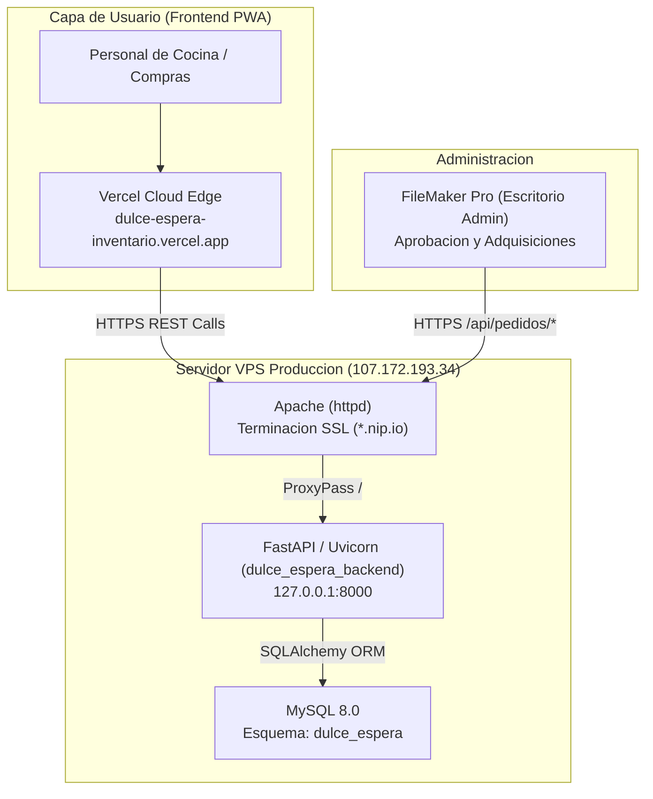

# Manual Tecnico y Arquitectura del Sistema - Dulce Espera Inventario

Fecha de actualizacion: Septiembre 2026  
Autor: Rene Velasquez  
Proyectos:
- Frontend PWA: `velasquezren/dulce-espera-inventario` (Next.js 16 + React 19 + TailwindCSS 4 en Vercel)
- Backend API: `velasquezren/dulce-espera-inventario-backend` (FastAPI + SQLAlchemy + MySQL 8.0 en VPS)

---

## 1. REGLAS CRITICAS: Convivencia y Seguridad en el Servidor VPS (107.172.193.34)

> [!CAUTION]
> **OBLIGATORIO PARA CUALQUIER DESARROLLADOR O AGENTE IA:**  
> Este servidor ejecuta multiples servicios de produccion criticos para la Clinica Montalvo.  
> Romper o reiniciar servicios ajenos interrumpira la operacion medica del CRM hospitalario.

### 1.1 Mapa de Servicios en el Host

| Servicio | Propietario / Funcion | Puerto | Politica Operativa |
|---|---|---|---|
| `crm_backend.service` | Backend NestJS - CRM Hospitalario | 3000 | **PROHIBIDO TOCAR, MODIFICAR O REINICIAR** |
| `postgresql.service` | Base de datos relacional del CRM | 5432 | **PROHIBIDO DETENER O MODIFICAR** |
| `httpd.service` | Apache Web Server / Reverse Proxy SSL | 80, 443 | **NO REINICIAR SIN TEST PREVIO (`httpd -t`)** |
| `mysqld.service` | MySQL 8.0 Multi-Esquema | 3306 | **NO REINICIAR GLOBALMENTE** |
| `dulce_espera_backend.service` | Backend FastAPI - Dulce Espera | 8000 | **UNICO SERVICIO AUTORIZADO PARA ESTE PROYECTO** |

### 1.2 Fronteras Operativas (Blast Radius)

Toda intervencion para este proyecto debe realizarse **EXCLUSIVAMENTE** dentro de los siguientes limites:
- **Directorio de aplicacion:** `/opt/dulce_espera_backend`
- **Entorno virtual Python:** `/opt/dulce_espera_backend/venv`
- **Servicio Systemd:** `dulce_espera_backend.service`
- **Esquema MySQL:** Unicamente `dulce_espera`
- **Usuario MySQL:** `app_dulce_espera`

### 1.3 Mandamientos Inviolables de Operacion
1. **NUNCA ejecutar `reboot`:** Apagara el CRM, PostgreSQL y servicios hospitalarios.
2. **NUNCA ejecutar `killall python`:** El servidor corre scripts de mantenimiento en Python.
3. **NUNCA ejecutar `systemctl restart mysqld`:** Se interrumpen las transacciones del CRM.
4. **Comando oficial de reinicio del proyecto:**
   ```bash
   sudo systemctl restart dulce_espera_backend
   ```
5. **Comando de diagnostico de salud:**
   ```bash
   sudo systemctl status dulce_espera_backend --no-pager
   curl -s http://127.0.0.1:8000/health
   ```

---

## 2. Arquitectura Global del Sistema



---

## 3. Catalogo de Insumos 2026 y Modelo Relacional

### 3.1 Catalogo 2026 (`Insumos2026.xlsx`)
- **800 registros cargados en total.**
- **771 insumos activos:** Disponibles en la PWA para creacion de pedidos de cocina.
- **29 insumos historicos (`activo = 0`):** Preservados para mantener integridad referencial de llaves foraneas con pedidos pasados en `detalle_pedido`.

### 3.2 Canales de Compra (`canal_compra`)
1. **Super Mercado (324 insumos):** Abarrotes empacados, pastas, harinas, aceites, enlatados, condimentos y suministros de limpieza.
2. **Mercado (323 insumos):** Perecederos frescos: verduras, hortalizas, frutas, tuberculos, carnes y pollo.
3. **Proveedor (119 insumos):** Proveedores mayoristas institucionales, formulas nutricionales y suministros especializados.
4. **Otros (34 insumos):** Panaderia diaria, bolsas y descartables.

### 3.3 Tablas Principales de Base de Datos
- `insumos`: `id_publico` (PK), `nombre`, `categoria`, `presentacion`, `canal_compra`, `activo`, `fecha_actualizacion`.
- `pedidos`: `id_publico` (PK UUID), `solicitante`, `fecha_solicitud`, `estado`, `fecha_estado`, `motivo`.
- `detalle_pedido`: `id_publico` (PK UUID), `pedido_id_publico` (FK), `insumo_id_publico` (FK), `cantidad`.
- `coordinadores`: `id` (PK INT), `nombre`, `telefono`, `activo`.
- `usuarios`: `id` (PK INT), `username`, `password`, `nombre_display`, `rol`, `activo`.

---

## 4. Motor de Reportes y Despacho

### 4.1 Excel Profesional con OpenPyXL
- **Reporte por Pedido:** `GET /pedidos/{id_publico}/reporte/excel`
  - Encabezados en verde clinico institucional `#006156`.
  - Agrupacion por canal con subtotales automaticos mediante formulas `=SUM(D{inicio}:D{fin})`.
  - Columnas de recepcion: `[  ] Recibido`, `Cant. Fisica`, `Observaciones`.
  - Bloques de firmas para Solicitante, Compras y Recepcion.
- **Reporte Maestro de Compras:** `GET /api/pedidos/pendientes/excel`
  - Consolida todas las solicitudes en estado `pendiente` agrupadas por canal para la gobernanta.

### 4.2 PDF con xhtml2pdf
- Endpoint: `GET /pedidos/{id_publico}/reporte/pdf`
- Documento formal en escala tipografica estricta, libre de emojis, optimizado para impresion fisica.

### 4.3 Hoja del Pedido en Imagen de Alta Densidad
- `lib/hoja-pedido.ts` dibuja la hoja en canvas a 3x, agrupada por canal, con total y firmas.
  Se carga bajo demanda desde el boton de cada pedido.
- La imagen se entrega al dialogo del sistema (Web Share API) o se descarga. La aplicacion no
  envia a ninguna aplicacion de mensajeria en particular.

---

## 5. Arquitectura del Frontend (Next.js 16 App Router)

### 5.1 Principios

- **Diseñado para el personal de cocina.** No es un panel administrativo: cuatro destinos, textos
  en lenguaje corriente, tipografia de 15 px o mayor y objetivos tactiles de 44 px. Todo lo que
  no sirve para pedir, seguir o recibir insumos vive en el area de compras o no existe.
- **Una ruta real por modulo.** Ya no existe un unico `page.tsx` que conmuta modulos por estado:
  cada seccion es una ruta del App Router, con su propia URL, su historial de navegacion y su
  paquete de JavaScript independiente. El personal puede marcar `/cuaderno` como favorito y el
  navegador solo descarga el codigo de la pantalla que abre.
- **Dominio antes que interfaz.** Los tipos (`Insumo`, `Pedido`, `LineaPedido`, `EstadoPedido`,
  `CanalId`) reflejan el modelo del backend en espanol. No hay traduccion entre "Product" y
  "insumo" ni heuristicas por nombre de producto: el canal y la categoria vienen de la API.
- **Estado fuera del arbol de React.** El catalogo y los pedidos viven en un store externo
  (`lib/recurso.ts`) consumido con `useSyncExternalStore`. Se descargan una sola vez por sesion,
  sobreviven a la navegacion entre secciones y se hidratan desde `localStorage` para funcionar
  sin conexion.
- **Cero deuda visual.** Todos los tokens de color, radio, sombra y tipografia estan declarados
  en `@theme` dentro de `app/globals.css`; no quedan clases utilitarias que no generen CSS.

### 5.2 Mapa de rutas

| Ruta | Contenido | Acceso |
|---|---|---|
| `/` | Redireccion al panel | Publica |
| `/acceso` | Inicio de sesion | Publica |
| `/panel` | Inicio: accesos grandes y ultimos pedidos | Cocina |
| `/cuaderno` | Catalogo de 771 insumos y lista para enviar | Cocina |
| `/solicitudes` | Seguimiento de pedidos y hoja para compartir | Cocina |
| `/recepciones` | Repaso linea por linea y confirmacion | Cocina |
| `/cuenta` | Sesion e instalacion de la PWA | Cocina |
| `/compras` | Lista de compras con checklist y cambio de estado | Rol compras |

Todas las rutas se generan como contenido estatico (`next build` las marca como `Static`), por lo
que el servidor no renderiza nada por peticion.

### 5.3 Estructura de carpetas

```
app/                         Rutas del App Router (solo enrutado y metadata)
  layout.tsx                 Fuente, metadata, viewport y proveedores globales
  manifest.ts                Manifiesto PWA tipado
  globals.css                Sistema de diseno completo (@theme de Tailwind 4)
  acceso/  (app)/  compras/  Segmentos de la aplicacion
components/
  ui/                        Biblioteca de interfaz: boton, campo, dialogo, avisos, filtros...
  shell/                     Barras lateral, superior e inferior, marca y guardas de acceso
  pwa/                       Registro del service worker
features/                    Una carpeta por pantalla (panel, cuaderno, solicitudes, recepciones,
                             cuenta, acceso y compras)
lib/
  api/                       Cliente HTTP tipado y un modulo por recurso de la API
  domain/                    Tipos, canales, estados, derivados y mensajes
  hooks/                     Sesion, catalogo, pedidos, cuaderno, conexion e instalacion
  recurso.ts                 Store externo de datos remotos con cache local
  almacenamiento.ts          Acceso tolerante a fallos a localStorage
```

### 5.4 Capa de datos

| Modulo | Responsabilidad |
|---|---|
| `lib/api/cliente.ts` | `fetch` con tiempo limite de 15 s, cancelacion y dos errores tipados: `ErrorApi` (el servidor respondio) y `ErrorRed` (no hubo respuesta) |
| `lib/api/insumos.ts` | `GET /insumos` a `Insumo[]` |
| `lib/api/pedidos.ts` | `GET /pedidos/todos`, `POST /pedidos`, `PATCH /pedidos/actualizar-estado` |
| `lib/api/coordinadores.ts` | `GET /coordinadores`, filtrando inactivos y telefonos invalidos |
| `lib/api/sesion.ts` | `POST /login` |
| `lib/api/reportes.ts` | URLs de los documentos oficiales generados por el backend |

La distincion entre `ErrorApi` y `ErrorRed` es la que decide si un pedido se encola: un rechazo del
servidor se muestra al usuario, una caida de red guarda el pedido y lo reintenta al reconectar.

### 5.5 Trabajo sin conexion

1. El catalogo y los pedidos se guardan en `localStorage` tras cada descarga correcta.
2. Al enviar un pedido sin red, se encola en `de.cola.v1` y aparece de inmediato marcado
   como *Sin enviar*.
3. Cuando el navegador recupera la conexion, la cola se vacia en orden; si un envio falla, se
   detiene y conserva el resto para el siguiente intento.
4. El service worker (`public/sw.js`) cachea unicamente recursos de este origen. Las llamadas a la
   API nunca se cachean.

### 5.6 Estandares de calidad

- **Politica cero emojis:** solo iconos vectoriales de `lucide-react`.
- **Sin `any`, sin `@ts-ignore`, sin `eslint-disable`** en el codigo de la aplicacion.
- **Accesibilidad:** objetivos tactiles de 44 px, foco visible, dialogos con foco atrapado y
  cierre con `Escape`, enlace para saltar al contenido y respeto por `prefers-reduced-motion`.
- **Busqueda sin acentos:** "limon" encuentra "Limón" en los 771 insumos.
- **Ortografia cuidada:** los textos de la interfaz llevan tildes y signos de interrogacion.
- **Verificacion antes de desplegar:** `npm run typecheck`, `npm run lint` y `npm run build`
  deben terminar sin errores.

## 6. Runbook de Despliegue y Mantenimiento

### 6.1 Despliegue de Frontend (Vercel)
```bash
cd "/Users/macmini2024/Documents/CARPETA RENE/dulce-espera-inventario"
npm run typecheck
npm run lint
npm run build
git add .
git commit -m "feat: actualizacion frontend"
git push origin main
```

### 6.2 Despliegue de Backend (VPS)
```bash
# 1. Commit y push local en repo de backend
cd "/Users/macmini2024/Documents/CARPETA RENE/inventario-dulce-espera/dulce-espera-inventario-backend"
git add .
git commit -m "feat: actualizacion backend"
git push origin main

# 2. Despliegue en VPS
ssh root@107.172.193.34
cd /opt/dulce_espera_backend
git pull origin main
/opt/dulce_espera_backend/venv/bin/pip install -r requirements.txt
sudo systemctl restart dulce_espera_backend
sudo systemctl status dulce_espera_backend --no-pager
```

### 6.3 Diagnostico y Resolucion de Errores

```bash
# Ver ultimos logs del backend en tiempo real
journalctl -u dulce_espera_backend -n 100 -f

# Verificar salud general de la API
curl -s https://107.172.193.34.nip.io/health

# Comprobar puerto 8000
ss -tlpn | grep 8000

# Rollback de emergencia en backend
cd /opt/dulce_espera_backend
git reset --hard HEAD~1
sudo systemctl restart dulce_espera_backend
```
